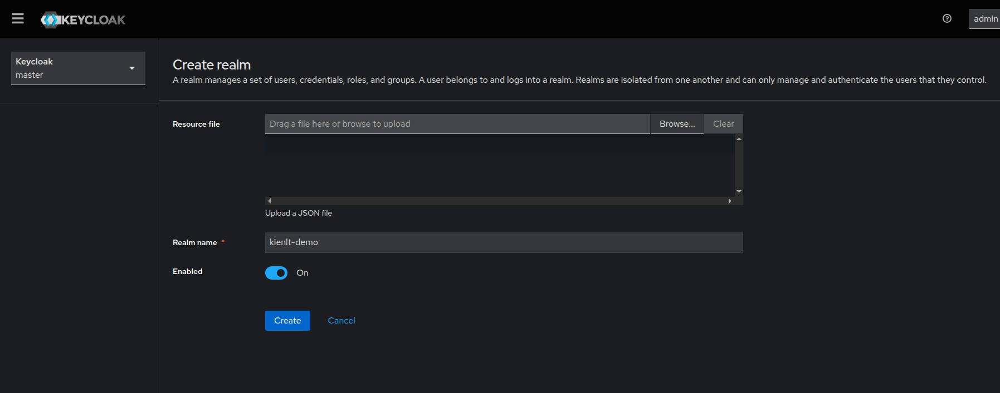
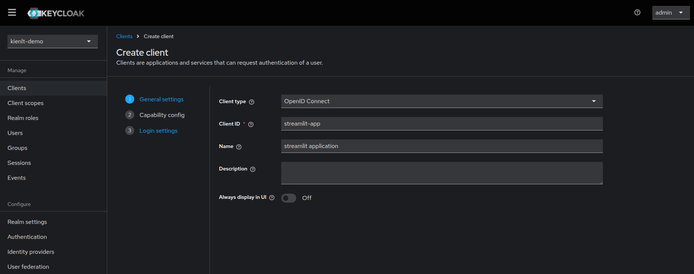
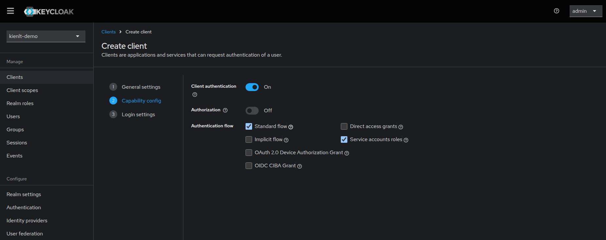
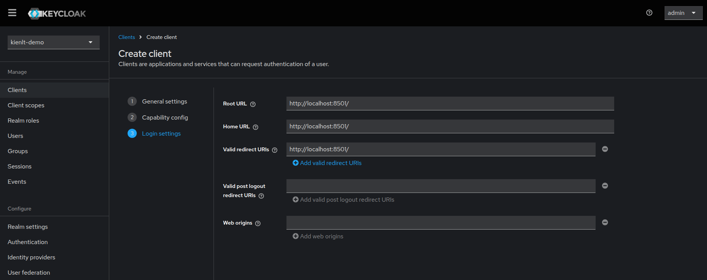
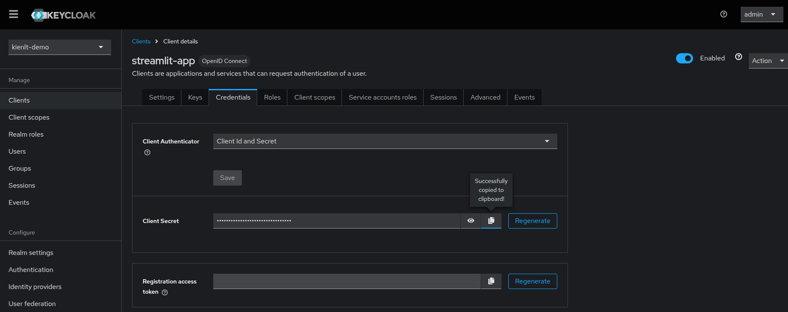
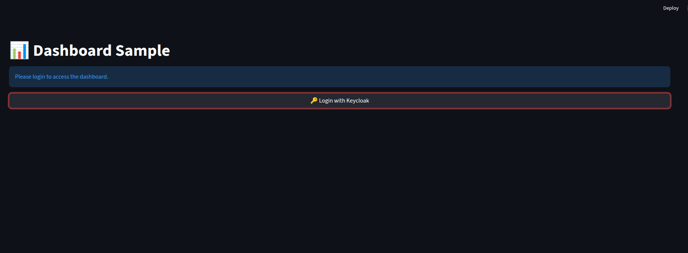
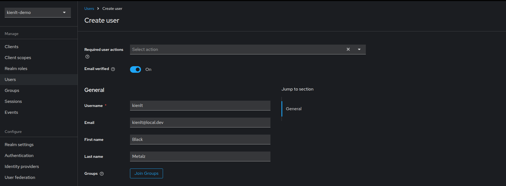
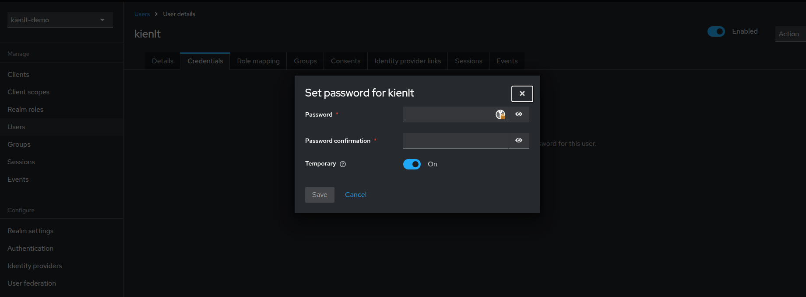
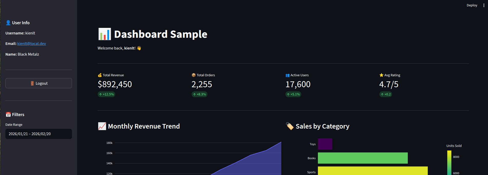
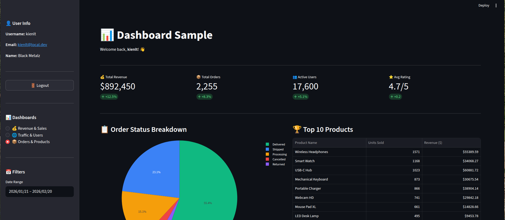

# Create new realm for testing purpose

- URL: http://localhost:8080/admin/master/console/#/master/add-realm

# Create new client

- URL: http://localhost:8080/admin/master/console/#/kienlt-demo/clients/add-client

Valid redirect URIs is wrong: please update to `http://localhost:8501/*`

# Copy client secret and paste to .env file

# Test Login

Umm, create account before login xD

Set password. I have no password policy so `123123` xDDD

Ok, time to login.

Success! Welcome to my dashboard xD

So issue in current state. Everytime I hit refresh/f5 button, it asked me to click button login again.

So worklog is create 3 dashboard with sidebar navigation for testing purpose.

Ok great. No issue after chaging dashboard

